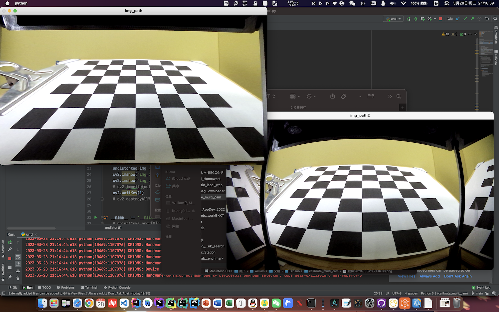
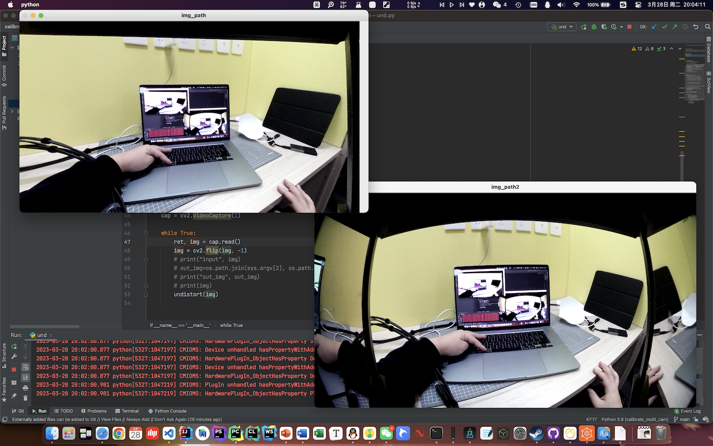

# Calibrate Camera

运行下面的代码安装环境

```shell
pip install -r requirements.txt  
```


# Step 1 捕获图像

现在项目目录创建 `cam` 文件夹，打开 `1_PictureCapture.py` 程序，运行。

按 `w` 按键捕获图像，捕获的图像均保存在 `cam` 文件夹当中。


# Step 2 分析计算

打开 `2_CalibrateCalculate.py` 程序。

修改 `CHECKERBOARD` 信息，从 `0` 开始计数。例如：我的标定板是 8x8 的，我就填写 `(7, 7)` 。

运行程序，如果拍摄图像无误，则可以获得类似下面的数据：

```
DIM=(1920, 1080)
K=np.array([[847.1189093859566, 0.0, 1003.1842217656019], [0.0, 841.0055737619359, 526.5010198089786], [0.0, 0.0, 1.0]])
D=np.array([[0.04546104968860118], [-0.2072673390197449], [0.2432519260920477], [-0.1288444975286356]])
```


# Step 3 矫正图像

打开 `3_Undistort.py` 程序。

将上一步获取的数据进行替换，运行程序，即可获得校正后的图像。需要将 VideoCapture 中的摄像头编号更换成你所使用的待矫正的摄像头编号。


# 运行效果






# 其他

项目中使用到的代码，整理一下，这个代码对于黑白相机矫正仍然不友好，经常报错，很是苦恼，希望有大佬能来优化一下。

其它问题欢迎进企鹅群交流：913211989 ( 小猫不要摸鱼 )

进群令牌：fGitCC